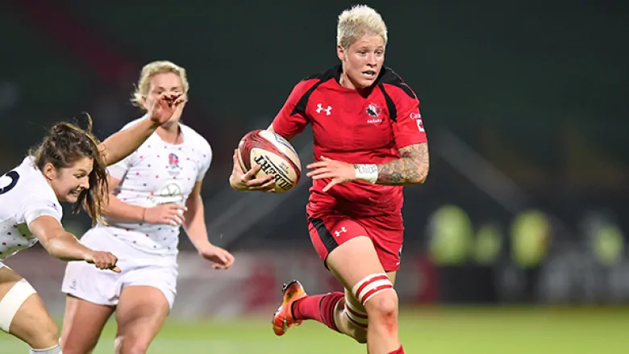

Analysis of Women's Rugby Performance
========================================================
author: Git 'R Dun
date: 3/31/19
autosize: true

Rugby7's
========================================================

hiafh

<!-- {width=20% } -->
<!-- xaringan -->

***

- They are strong 
- They are cool 
- They are successful

<!-- rugby and how speed is important  -->

<!-- pick one tournament and one game<- Paris  -->

<!-- talk more about data and explain it -->
<!-- no progress oriented  -->
<!-- research rugby  -->
<!-- speed is most important in game especially because it's really short  -->
<!-- one or two visualization slide  -->
<!-- one with model  -->

<!-- For more details on authoring R presentations please visit <https://support.rstudio.com/hc/en-us/articles/200486468>. -->

<!-- - Bullet 1 -->
<!-- - Bullet 2 -->
<!-- - Bullet 3 -->

Our Question
========================================================

We want the rugby teamm to be at its best performance, but how can we do that using the data we have? 

Dat Visualization
========================================================

What They Can Do
========================================================

What can the Rugby 7's do to enhance their performance based on our findings? 

- One
- Two 
- Three
